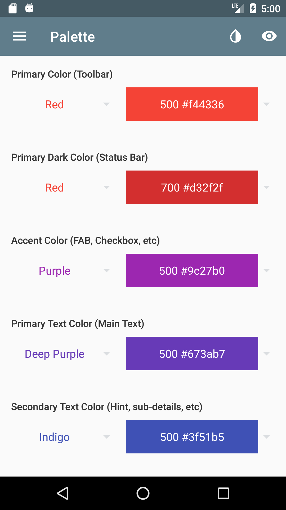

# Material Palette

**Material palette** for Google's material design colors

This Android app shows all colors from Google's material design color guide, and provides a simple setup and preview for different color theme combinations

  
  

## License
MIT © [lcgforever](https://github.com/lcgforever)
